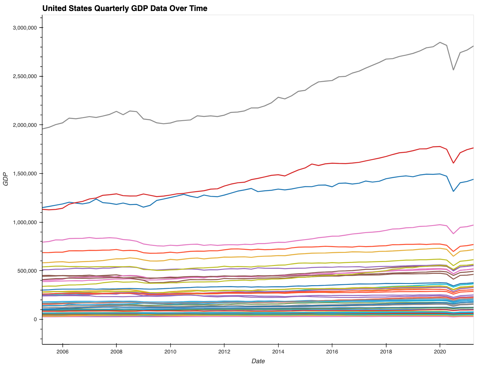
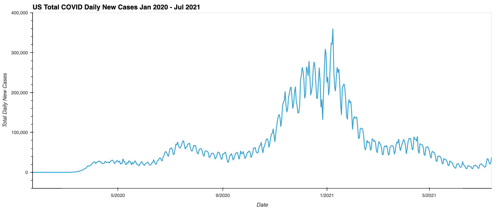
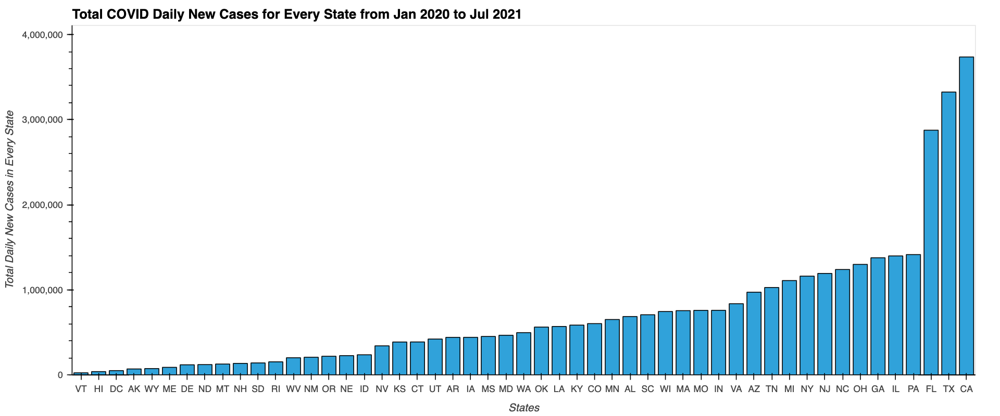
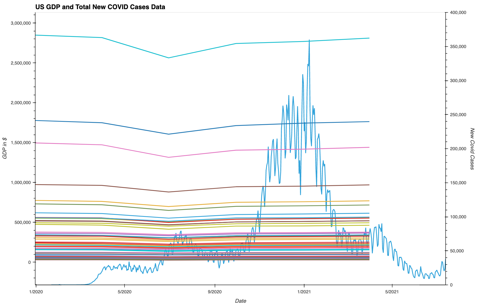
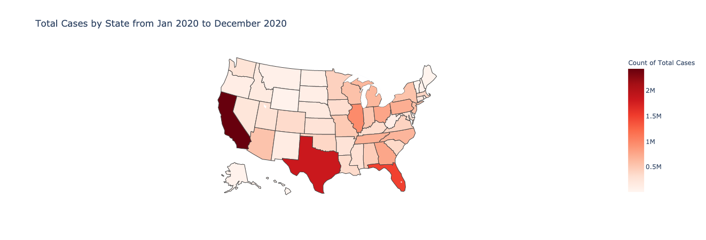

# COVID-19 Effects on Regional GDP

This Jupyter Notebook provides an analysis of COVID effects on the Gross Domestic Product (GDP) of the 50 states and Washington, D.C..

Specifically, it provides:
* An analysis of US State GDP data, including an interactive plot of GDP for each state in the US for the timeframe of Q1 2005 through Q1 2021.
* An analysis of US COVID data, including interactive plots for total US cases and cases by each state for the timeframe of January 2020 to July 2021.
* A combined analysis including an overlay plot and map visualizations of US State GDP and COVID data.

---

## Data Sources

* COVID dataset - [CDC](https://data.cdc.gov/Case-Surveillance/United-States-COVID-19-Cases-and-Deaths-by-State-o/9mfq-cb36)
* GPD dataset - [Bureau of Economic Analysis](https://apps.bea.gov/regional/downloadzip.cfm)

---

## Technologies

This analysis is a Jupyter Notebook that makes use of the following Python libraries:
* Bokeh
* Pandas
* Pathlib
* PyViz - hvPlot library
* PyViz - Plotly Express library
* PyViz - Plotly Graph Objects library

---

## Installation Guide

To use this notebook:
* Install Jupyter Lab Version 2.3.1 and Python 3.7.
* Install PyViz visualization package.
* Install Plotly Express version 4.13.0.
* Install hvPlot version 0.7.0 or later.
* Install NodeJS version 12 or later.
* Bokeh, Pandas, and Pathlib should already be included by the previous dependencies.  If not, install them.

Open the notebook in Jupyter Lab and you can rerun the analysis.

---

## Examples

Here are examples of the interactive plots in this notebook:

---

## Contributors

* Allen Wong

* Christine Guo 

* LaNaya Johnson 

* Michael Danenberg

---

## License

MIT